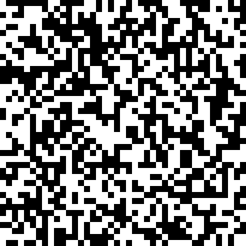
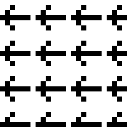
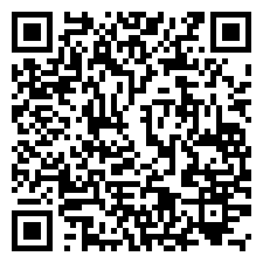

# 2D Cyrpto

> The Tadzjikistan ministery of Tourism has issued an in house developed method of encrypted communication to be used for confidential government information. We intercepted an as far as we know important message. Can you analyze this one for us? Our secret service has received some leaked code from contacts inside, maybe it will be of use.

```python
# We recovered a piece of the encryption code

def encrypt(qrcode, key):
    size_x, size_y = qrcode.size
    for i in range(size_x):
        for j in range(size_y):
            pixel = (qrcode.getpixel((i, j)) > 0) ^ key[i%KEYSIZE][j%KEYSIZE]
            qrcode.putpixel((i, j), pixel)
    return qrcode
```



## Solution
### Reconnaissance 

After a quick glance at the image, it looks like we got a bunch of random pixels.
Not much we can do with it.
Taking a look at the attached code, which looks to be python, gives us a starting point.
The function `encrypt` requires 2 arguments: `qrcode` and `key`.
Then, every pixel of qrcode is xorred with the value in `key`, which also looks to be a 2D array.
When searching for the funtion `getpixel` online, we find that it is part of the Python Imaging Library, or PIL for short. Let's take the same route as the Tadzjikistan governement and also use that library for our solution. For now, let's assume the keysize is 7.

```python
from PIL import Image

KEYSIZE = 7

#make a sort of smiley
key = [
[0,0,0,1,0,0,0],
[0,0,1,1,1,0,0],
[0,1,0,1,0,1,0],
[0,0,0,1,0,0,0],
[0,0,0,1,0,0,0],
[0,0,0,1,0,0,0],
[0,0,0,0,0,0,0]
]

clean = Image.new('1', (40, 40), "white") # make a new image
clean = encrypt(clean, key).resize((410,410))
clean.show() 

```

This gives the following image as result:



The encrypt function just xors the key repeatedly over the image.
(And it looks like we'll have to look out not to confuse the x and y axis.)
If that is what happened to the intercepted picture, we need to do the same.
But to do that, we need to recover the key first.

### QR Codes
To recover the key, we can use our suspicion that we are dealing with a QR Code.
QR Codes have large parts that are constant, namely the blocks in every corner and some lines running over the image.
This allows for a known plaintext attack.
The image counts 41 pixels in width and height, which seems to be a valid QR Code size.
Using the very comprehensive [Wikipedia article](https://en.wikipedia.org/wiki/QR_code), we can create this 2D array of known values:

```python
known = [
        "00000001                         10000000",
        "01111101                         10111110",
        "01000101                         10100010",
        "01000101                         10100010",
        "01000101                         10100010",
        "01111101                         10111110",
        "00000001010101010101010101010101010000000",
        "11111111                         11111111",
        "      0                                  ",
        "      1                                  ",
        "      0                                  ",
        "      1                                  ",
        "      0                                  ",
        "      1                                  ",
        "      0                                  ",
        "      1                                  ",
        "      0                                  ",
        "      1                                  ",
        "      0                                  ",
        "      1                                  ",
        "      0                                  ",
        "      1                                  ",
        "      0                                  ",
        "      1                                  ",
        "      0                                  ",
        "      1                                  ",
        "      0                                  ",
        "      1                                  ",
        "      0                                  ",
        "      1                                  ",
        "      0                                  ",
        "      1                                  ",
        "      0                         00000    ",
        "111111110                       01110    ",
        "00000001                        01010    ",
        "01111101                        01110    ",
        "01000101                        00000    ",
        "01000101                                 ",
        "01000101                                 ",
        "01111101                                 ",
        "00000001                                 "
        ]

```

### Recovering the key
To recover the key, all we need to do is to xor the part of the image that we know, with the part of the 'encrypted' image.
We don't know the keysize, but we do know that if we take a wrong keysize, the key won't line up with what we know.
So if at one point in our key retrieval procedure we find a contradicting pixel, we are probably wrong about the keysize.

Let's write some code to help us:

```python
from itertools import product # for a fancy way of iterating over a 2D array

# Let's define the key as an array initialized with -1s.
key = [[-1 for _ in range(KEYSIZE)] for _ in range(KEYSIZE)]


def retrieve_key(img, key, known, keysize=7):
    for x, y in product(range(41), repeat=2): # iterate over every pixel
        if known[y][x] == " ": # if we don't know what should be here
            continue
        value = int(known[y][x]) ^ (img.getpixel((x, y)) > 0)
        # if we find a contradicting pixel, we are probably wrong
        if key[y%keysize][x%keysize] > -1 and value != key[y%keysize][x%keysize]:
            return False
        key[y%keysize][x%keysize] = value

    return key
```

Some people may already have noticed a problem.
We don't know enough to recover the whole key, so there will always be a part of the image that we need to guess.
Luckily for us, QR Codes are known to contain error correction, so let's hope that will work.


Time to recover the key for real:

```python
# open the image and resize it
img = Image.open("challenge.png").convert("1").resize((41, 41))

for k in range(1, 20):
    key = [[-1 for _ in range(k)] for _ in range(k)]
    key = retrieve_key(img, key, known, k)

    if not key:
        print ("It's not", k)
        continue

    print("It is", k)
    print()

```

Running the code, we find:
```
It's not 1
It's not 2
It's not 3
It's not 4
It's not 5
It's not 6
It's not 7
It's not 8
It's not 9
It's not 10
It's not 11
It's not 12
It is 13
It's not 14
It's not 15
It's not 16
It's not 17
It's not 18
It's not 19
```

Looks like we found our key! Or at least, part of it.
Printing the key, we see that we still miss a small part in a corner.
Nothing to do about it for the moment, let's hope we have enough.
```
.............
.............
.............
.............
.............
.............
.............
.............
...........##
...........##
...........##
........#####
........#####
```


## Final steps
Almost there.
All that is left to do is to xor the image again with our key, after which we hopefully end up with a working QR Code.
We base our xor function on the given encrypt function, resulting in the following code:

```python
def xor(qrcode, key, keysize=13):
    for x, y in product(range(41), repeat=2):
        if key[y%keysize][x%keysize] == -1: # the unknown parts
            continue
        pixel = (qrcode.getpixel((x, y))>0) ^ key[y%keysize][x%keysize]
        qrcode.putpixel((x, y), pixel)
    return qrcode
```


Using the function above, and after some resizing and positioning, we get our final image.
```python
img = xor(img, key, i)

show_img = Image.new("RGB", (450, 450), "white")
show_img.paste(img.resize((410, 410)), (20,20))
show_img.show()

```



Lo and behold, long live error correction! Scanning the QR Code with a phone or online tool reveals the flag.

### Backup plan

In case the error correction wasn't enough, we could have tried guessing version codes. This website has a nice tutorial about version codes and where they are placed on the QR Code: https://www.thonky.com/qr-code-tutorial/format-version-information
