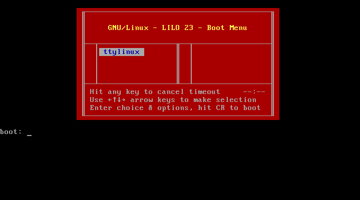
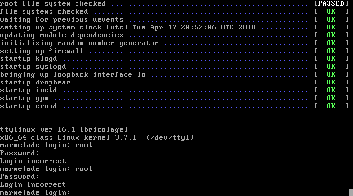
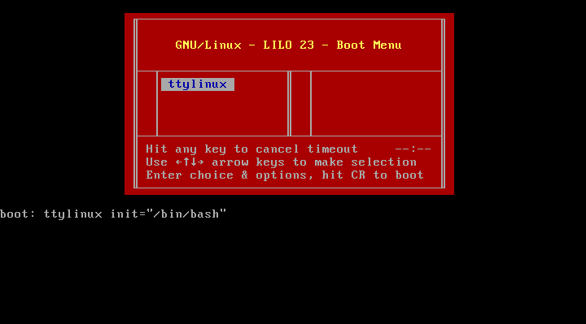
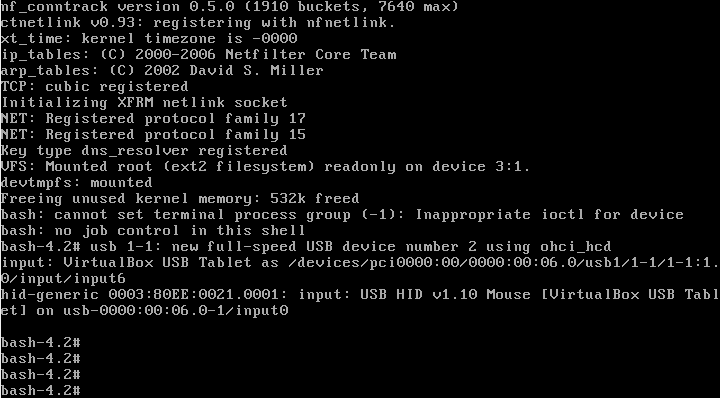
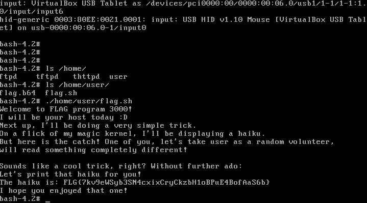
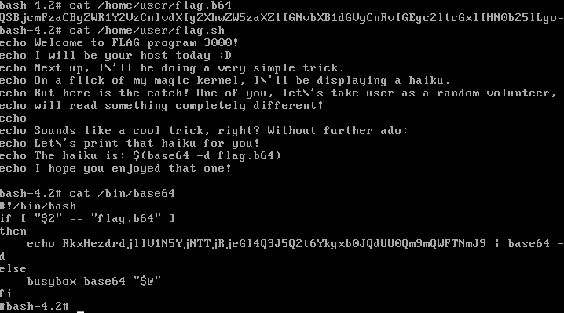

# Lost password

> I lost the password to my virtual machine. There was a really nice magic trick on it, but now I can't reach it. Can you recover the trick for me?

## Write-up

### Exploration
For this challenge, we receive a ova file. After a bit of online searching, and also reading the flavor text, reveals we received a virtual machine.
Using the virtualization software of our choice (I'll be using Virtualbox), we can power up the virtual machine and look inside.

We are greeted with the following screen:

Let's press enter for now. After the boot process, we get a tty login.

We try to guess some passwords, but it doesn't look like this approach will work. We have to find a way around!

### Boot loaders

Going back to the boot loader, we read the title: `GNU/Linux - LILO 23 - Boot Menu`.
[Wikipedia](https://en.wikipedia.org/wiki/LILO_(boot_loader)) tells us this stands for "Linux Loader".
LILO was once the default boot loader for most Linux distributions. These days, GRUB fills that role.
The goal of the boot loader is to start some critical systems, after which the main operating system takes over.
After getting everything ready, it executes the system init process.
The init process then starts up Linux and eventually presents us with the login screen.

### Solving the challenge

For Linux, it is possible to override this init process to whatever we want.
If, for example, we change the init process to /bin/bash, Linux will just execute the bash shell straight away and give us a system shell, without any need of passwords.
After a bit of online searching, we find how to edit the init option in LILO:

We get a lot of text, but after pressing enter a few times, it's clear we have entered a shell.

After some searching, we quickly find a file called `flag.sh`. After executing it, we find the flag.

### How not to do it

What we also could have tried, was mounting the internal hard drive to another machine and searching through the files, without ever needing to change the init process.
This however, fails! Only when executed on the system, we get the flag. How does that work?

The trick behind this was a modified `/bin/base64` executable on the VM.
I made this intentionally hard to find, to force the solver to circumvent the lost password and log in into the machine.

