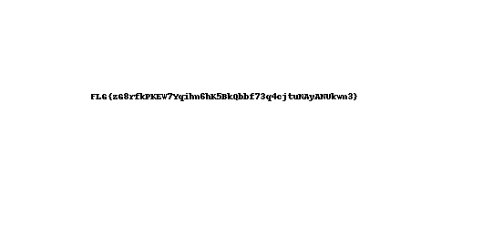

# animated-apps

> The NSA has been creating apps to spy on everyone. We got hold of one and would like you to analyze it.
>
> Sponsored by GuardSquare

## Write-up 

In this challenge, you could download a file called [app.apk](app.apk). This is an Android app. `apk` files are simple zips, so we can open them to see what's inside. Apart from some folders, we find five files:

- META-INF/CERT.SF
- META-INF/MANIFEST.MF
- res/logo.png
- classes.dex
- resources.arsc

The first two are plantext files that sadly don't contain the flag. They both have a reference to `res/logo` though. Since dex and arsc files are binary formats, and we already have a hint that the logo might be interesting, let's have a look at that file first. We can simply extract it using our zip utility.

Our image viewer opens the file just fine, and we don't see anything weird at first sight. Can a more sophisticated image editor like [GIMP](https://www.gimp.org/) help us? If we try it, we see that the image actually has three frames. By inspecting the file a little closer, we can find out why:

```
$ file logo.png
logo.png: GIF image data, version 89a, 552 x 272
```

It is not a PNG image at all, it's a GIF! GIFs are often used for animations, and the title of this challenge also points in that direction. Looking at the frame contents, we can see that the first and third frame are identical and have a very long viewing time. The middle frame, however, is different and has a viewing time of only 10 milliseconds. It contains a picture of the flag:


