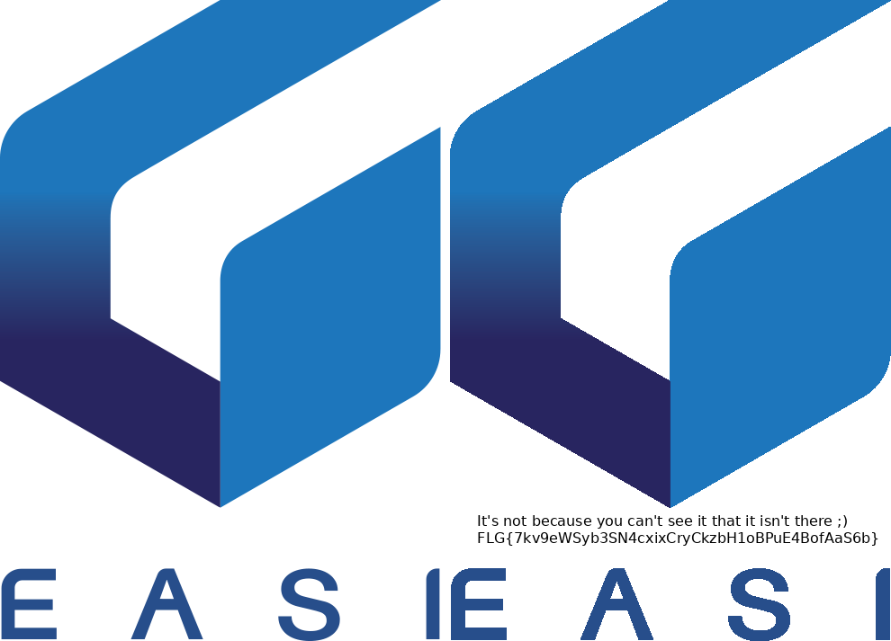

# PMMA

> EASI is one of the companies who helped us bring this CTF to life. Look at their logo, nice isn't it? Keep looking! Can you see Alpha Centauri yet?

## Solution
This was a sponsor challenge for EASI, meant to have an easy solution.
We are given the logo of EASI in png format, with a transparent background.
A quick search for PMMA on your favorite search engine reveals that PMMA is often used as an abbreviation for Polymethylmethacrylaat, also known as acrylic glass.
This leads us to the idea that the challenge has something to do with transparency.

In addition to the well know RGB values of an image, the png format allows a 4th layer, the Alpha layer. The value of the alpha layer determines how transparent a pixel is. This is useful for a wide range of images, including logos. When the alpha value of a pixel is 0, the pixel is completely transparent. A value of 255 means that the pixel is opaque.

This however, doesn't mean that a transparent pixel has no RGB value! It's not because you can't see it, that it isn't there. To solve this challenge, we need to remove the alpha layer to reveal the hidden pixels. This can be done in a million ways, like editing the picture in Gimp, or converting it to a jpg (which doesn't support an alpha layer). Using the utility `convert` from imagemagick, we convert the png to a jpg: `convert EASI.png EASI.jpg`. The result can be seen below:

## Good to know
This is actually a not very well known cause of problems in games and photo editing, as a lot of software still uses the invisible RGB values when blending images into other images. A lot of transparent images on the internet have some invisible information beneath their transparency layer. Take the official black transparent LOKO logo found on their [website](https://loko.be/kennisdatabank/artikel/?id=124) . When removing the alpha layer, we can see the aftermath of some photo editing.

The logo of Tomorrowland as found on this [website](http://logos.wikia.com/wiki/File:Logo-tomorrowland.png) has it even worse. Or so you would think. Extending (or *bleeding*) the colors like this helps to mitigate the blending problems as described earlier. This type of pattern is generated automatically for exactly this reason.

If you want to read more about this issue, I recommend this very well written blogpost: https://www.adriancourreges.com/blog/2017/05/09/beware-of-transparent-pixels/

