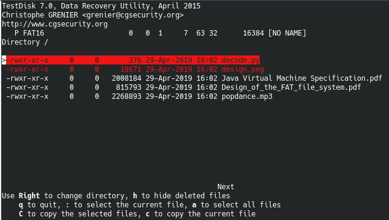
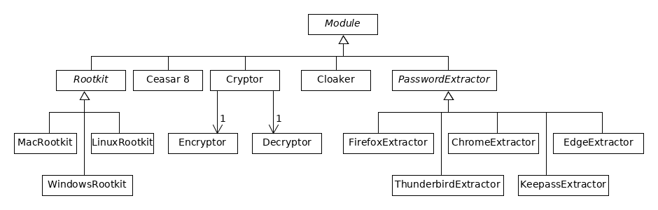

# fat-man writeup

When we download the drive.img file and open it, it looks like garbage. We can use use Linux's `file` command to figure out what type of file it is:

```
drive.img: DOS/MBR boot sector, code offset 0x3c+2, OEM-ID "ULYSSIS ", FAT  1, root entries 512, sectors 16384 (volumes <=32 MB), Media descriptor 0xf8, sectors/FAT 64, sectors/track 32, heads 64, serial number 0xa635730, unlabeled, FAT (16 bit)
```

It looks like a FAT16 drive file. Let's mount it and see what's going on. Darn, it looks like the files aren't that interesting. However, the malware developer was friendly enough to leave a copy of the FAT16 specification. Quickly reading though it, we notice something peculiar: when files are deleted, they aren't actually gone. All data still exists on the drive. Perhaps there are some deleted files and we can try to 'undelete' them?



One of the most interesting tools for data recovery is `testdisk`. It has a Windows, Mac, and Linux version. Using `testdisk`, we can see there's 2 deleted files, and undelete them. The decode.py file looks the most interesting, so we'll look at it first. The file contains some python code and some string that looks like the flag but isn't quite right. However, if we execute the python file it prints the real flag!

The other file, design.png, looks like the design blueprints for some malware. Although we're not interested in this, we might want to hand it over to the FBI.


