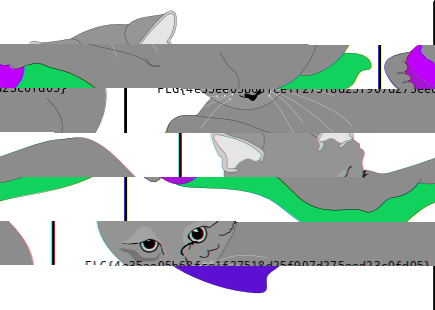
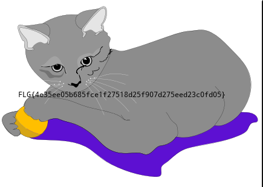

# felines writeup
The challenge text, `Somebody tore up the picture of my sweet kittens! Can you save it?`, hints that we have to restore an image file.

We extract the zip file and analyse all files with `file`

```bash
$ file *
b: data
i: data
l: PC bitmap, Windows 3.x format, 435 x 310 x 24
m: data
n: DOS executable (COM, 0x8C-variant)
o: DOS executable (COM, 0x8C-variant)
p: data
```

One of the files, `l` is appears to be a bitmap file, which is a well-known lossless image format.
The [wikipedia page on the BMP file format](https://en.wikipedia.org/wiki/BMP_file_format#Device-independent_bitmaps_and_the_BMP_file_format) learns us that the file is composed of a fixed header followed by raw pixel data. This means that as long as we start the file with the header, we will get a valid BMP image file, although it may be scrambled.

We try opening the `l` file in an image editor, but it only contains a bottom and looks broken .

Because the image was torn up, we will try restoring it by con*cat*enating the files together.

We try combining the files with a random combination: `lbimnop`.

```bash
$ cat l b i m n o p > lbimnop.bmp
```

This gives us an interesting, but scrambled, image: 

Even with this scrambled image, we are able to see a flag, which is the correct solution to the challenge, but because it's scrambled, it is hard to read.

To restore the full image as it is supposed to look, we write a python script that will try out all possible combinations:

```python
import itertools

for combination in itertools.permutations('bilmnop'):
    with open(''.join(combination), 'wb') as outfile:
        for f in combination:
            with open(f, 'rb') as infile:
                outfile.write(infile.read())

```

With the knowledge that `l` is the first file to create a valid BMP file, the script can be optimised to only create files that start with this letter. This optimisation is left as an exercise to the reader.

Just open all the valid image files and look which one does not look scrambled. We discover that when we put the files in the correct order, they spell out `lionbmp`, or, `lion.bmp`.


