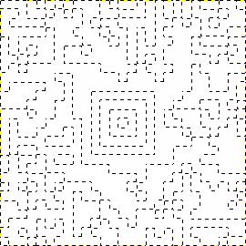

# Snow in Old Mexico

> It has snowed so much, my image is all white! It had my onboarding code to get onto the plane to Mexico. Can you help me get it back? 

The task consists of a white image:


You probably can't tell with the naked eye, but the image isn't all white. If we use an image editor that supports "Select by colour", we can click anywhere to show the pattern:



If we fill in the pieces in black, we get an image that looks somewhat like a QR code. It is in fact an "Aztec" code (hence the challenge name), but most scanners that can deal with QR can just as well handle Aztec codes. Here it is in full:


Which decodes to:

```
FLG{30a40b041fef4bd4fe838c8e41134c1df0df10152ed2}
```
