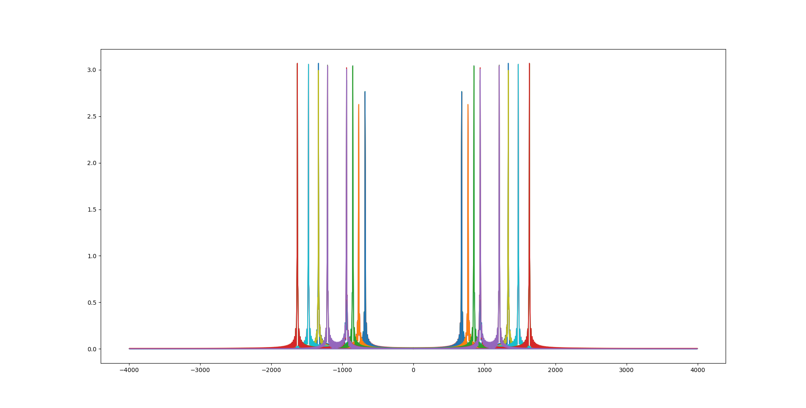

# bleepbleep writeup

The participants are handed a `.wav` file containing something sounding like
the tones heard when dialing a phone number.

This is a
[DTMF](https://en.wikipedia.org/wiki/Dual-tone_multi-frequency_signaling)
signal, and the purpose of this challenge is to decode it.

This can be done easily using Python and numpy, using the latter's `fft`
implementation: when a symbol is sent, two peaks in the frequency spectrum
should stand out (as the signal is the sum of two sine waves). These peaks
should correspond to the ones defined in the standard (see the Wikipedia
article).

First, we have to define the decoding table:

```py
# from Wikipedia (https://en.wikipedia.org/wiki/DTMF),
# originally taken from the ITU-T standard Q.23.
dtmflut = [
    (941,1336),(679,1209),(679,1336),(679,1477), # 0 1 2 3
    (770,1209),(770,1336),(770,1477),(852,1209), # 4 5 6 7
    (852,1336),(852,1477),(679,1633),(770,1633), # 8 9 A B
    (852,1633),(941,1633),(941,1209),(941,1477), # C D * #
]
```

The WAV file contains 8 kHz mono 16-bit integer PCM data, making it easy to
analyze. Let's import it:

```py
import struct, sys, wave

frames = None
rate   = 0
with wave.open(sys.argv[1],'rb') as ww:
    bs = ww.readframes(ww.getnframes())
    rate = ww.getframerate()
    frames = struct.unpack('<' + str(len(bs)//2) + 'h', bs)
```

Then we have to cut the audio file into sequential blocks of non-silence, as
directly taking the FFT of the entire wave will make us end up having no way
to find out when which symbol was sent.

```py
blockstart = 0
blockend   = 1
zerocount  = 0

i = 1
blocks = []
while i < len(frames):
    if frames[i] == 0:
        zerocount = zerocount + 1
        if zerocount > 10: blockend  = i
    else:
        if zerocount > 100: # pause is long enough
            print("block",blockstart,blockend)
            blocks.append(frames[blockstart:blockend])
            blockstart = i
        zerocount = 0
    i = i + 1

blocks.append(frames[blockstart:]) # don't forget the final block
```

Now we're ready to analyze each separate block to find the peaks:

```py
import numpy
#import matplotlib.pyplot as plt

for b in blocks:
    #print("block")
    rr = numpy.arange(len(b))
    fs = abs(numpy.fft.fft(b))/(len(b)*len(b)) # take the fft, discard the phase information

    # uncomment for pretty graphs!
    #freq = numpy.fft.fftfreq(rr.shape[-1])*rate
    #plt.plot(freq, fs)
    #plt.show()
```

This lets us look at the frequency spectum, the graphs look like this:


Now we need to find those peaks:

```py
    peaks = set()
    for r in range(len(fs)//2): # /2: only positive freqs
        if fs[r] > 1.1:
            fr = r*rate/len(b)

            if all(abs(fr-p) > 8 for p in peaks): # not a smeared-out peak
                peaks.add(fr)
```

All that's left is to figure out which symbol the peaks correspond to:

```py
    print("peaks:", str(peaks)) # should be two of them
    for pi in range(len(dtmflut)):
        if all(any(abs(e - p) < 4 for e in peaks) for p in dtmflut[pi]):
            print(pi)

```

Let's see if it works:

```
$ ./decode.py test.wav
block 0 2000
block 2001 4000
block 4001 6000
block 6001 8000
block 8001 10000
block 10001 12000
block 12001 14000
block 14001 16000
block 16001 18000
block 18001 20000
block 20001 22000
block 22001 24000
block 24001 26000
block 26001 28000
block 28001 30000
peaks: {1336.0, 940.0}
0
peaks: {1208.6043021510754, 676.3381690845423}
1
peaks: {676.3381690845423, 1332.6663331665834}
2
peaks: {1476.7383691845923, 676.3381690845423}
3
peaks: {768.384192096048, 1208.6043021510754}
4
peaks: {768.384192096048, 1332.6663331665834}
5
peaks: {768.384192096048, 1476.7383691845923}
6
peaks: {848.424212106053, 1208.6043021510754}
7
peaks: {848.424212106053, 1332.6663331665834}
8
peaks: {848.424212106053, 1476.7383691845923}
9
peaks: {1632.8164082041021, 676.3381690845423}
10
peaks: {768.384192096048, 1632.8164082041021}
11
peaks: {848.424212106053, 1632.8164082041021}
12
peaks: {1632.8164082041021, 940.4702351175588}
13
peaks: {1208.6043021510754, 940.4702351175588}
14
peaks: {1476.7383691845923, 940.4702351175588}
15
```
