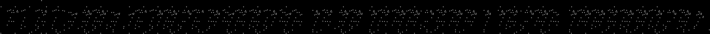
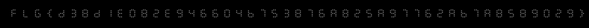

# Zero player game

We are presented with the following image:



The flavortext tells us that this is new zero player game. Searching for this term on the internet turns up this wikipedia page: https://en.wikipedia.org/wiki/Zero-player_game with the first example being Conway's game of life. The most famous pattern of Conway's game of life is the glider (https://conwaylife.com/wiki/Glider), and indeed, it seems that the image we were presented with consists of just gliders.

The solution to this challenge is to evolve the given image with the rules of Conway's game of life. A slow but simple way of doing this is the following python script:

```python
import numpy as np
import tqdm
from PIL import Image

img = Image.open("zero-player-game.png")

universe = np.asarray(img).tolist()

xlen = len(universe[0])
ylen = len(universe)

for _ in tqdm.tqdm(range(250)):
    next_universe = [xlen * [0] for _ in range(ylen)]

    for i in range(1, ylen - 1):
        for j in range(1, xlen - 1):
            ru = universe[i - 1]
            r = universe[i]
            rl = universe[i + 1]

            s = ru[j - 1] + ru[j] + ru[j + 1] + rl[j - 1] + rl[j] + rl[j + 1] + r[j - 1] + r[j + 1]

            match s:
                case 3:
                    next_universe[i][j] = True
                case 2:
                    next_universe[i][j] = universe[i][j]

    universe = next_universe

Image.fromarray(np.array(universe, dtype=bool)).save("solved.png")
```

After about a minute of computation, this gives us the following image:


