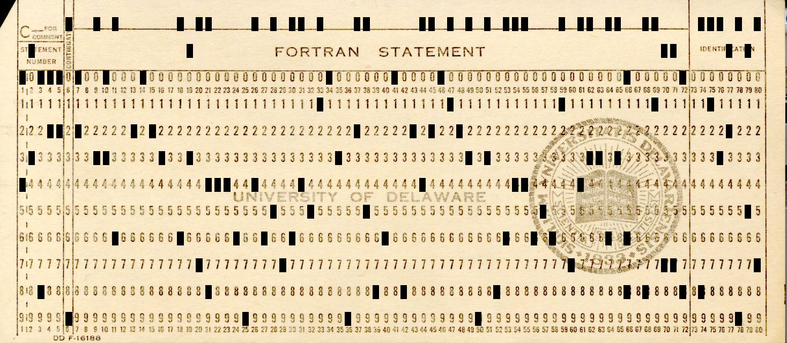

# holler writeup

This challenge is a simple JPG file showing an image of... a punch card.

Many possible encodings for punch cards exist, but this one has 80 columns, a
standard introduced by IBM. IBM is also infamous for having invented a related
character set, [EBCDIC](https://en.wikipedia.org/wiki/EBCDIC). And, lo and
behold, this page contains an image that can be used to easily decode such
punch cards on sight.

Decoding the message on the given image yields `ULYSSIS CTF 2023 FLG<(flag
here)> HAPPY HACKING`.
