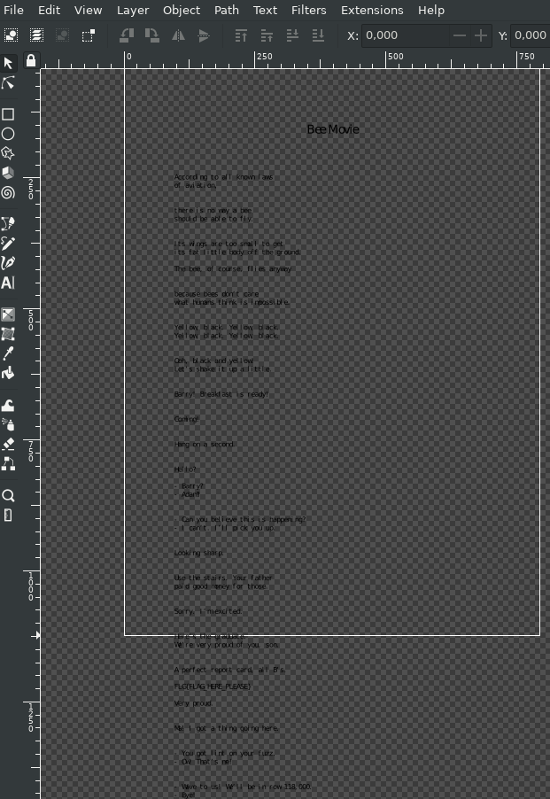

# overfull-vbox writeup

> Hey, I sneaked around at the research department,and found a work-in-progress
> paper with some interesting stuff in it! You should have a look!

We are given a PDF file containing.. the Bee Movie script. Except, this PDF
consists of only a single page, and the text is cut off at the bottom...

`strings` doesn't seem to be giving us the answer, as a PDF consists of mostly
compressed data blobs. However, opening the PDF in eg. Inkscape *does* show us
the rest of the text:

The flag is found quickly a bit further down. Or you could copypaste the text
into a simple text editor and use Ctrl+F.

